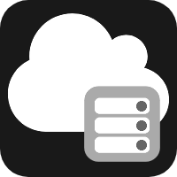
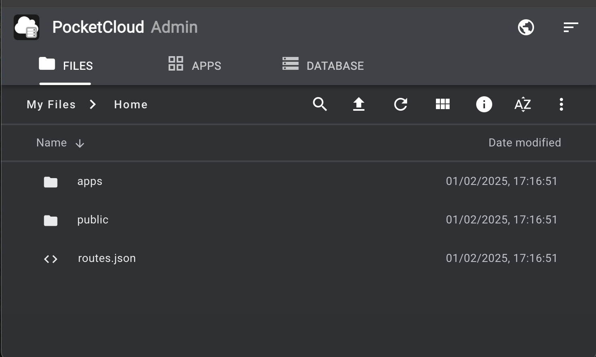

<table>
  <tr>
    <td>
      
    </td>
    <td>
      <h1>PocketCloud</h1>
    </td>
  </tr>
</table>

Light weight, user friendly Cloud Services built on PocketBase, NodeJS and PM2

- Easy to use online dashboard
- Edit your content directly in the cloud and see results instantly
- Deploy NodeJS based Services and REST APIs in minutes
- Build a Cloud Database for your apps using the popular PocketBase DB
- Publish Static Websites or Shared Files simply using drag-n-drop
- Low CPU and RAM requirements
  
 

# Deployment

# Usage

To access tha admin dashboard simply add the <b>/_admin path</b> in your browser address bar, for example:  
     &nbsp;&nbsp; https://pocketcloud123-production.up.railway.app/_admin  
 
Use the Files tab in the Dashboard to edit the the home-page by right-clicking on this file:  
     &nbsp;&nbsp; <b>/apps/public/index.html</b>  
 
To access tha demo REST API add the <b>/api/info</b> path in your browser address bar, for example:  
   &nbsp;&nbsp; https://pocketcloud123-production.up.railway.app/api/info  
 
Use the Files tab in the Dashboard to edit the source code for this demo API by right-clicking on this file:  
   &nbsp;&nbsp; <b>/apps/my-api/index.js</b>  
 
 
Published by droidscript.org as part of the enjine-io multi-platform framework. 
For more information contact support@droidscript.org

     
